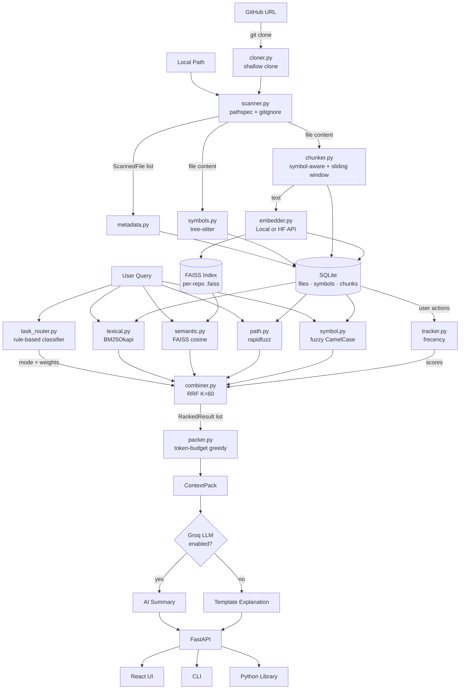

<div align="center">

# RepoMemory

**AI-powered code retrieval engine — index any GitHub repo, search with natural language**

[](https://pypi.org/project/repomemory/)
[](https://pypi.org/project/repomemory/)
[](https://www.python.org/)
[](https://fastapi.tiangolo.com)
[](https://react.dev)
[](https://opensource.org/licenses/MIT)
[](https://github.com/aayushakumar/RepoMemory/actions/workflows/ci.yml)

*Point it at any GitHub URL. Get token-budget-aware context packs — ready to paste into any LLM. Free to deploy, free to run.*

</div>

---

## Table of Contents

1. [What is RepoMemory?](#what-is-repomemory)
2. [Features](#features)
3. [Quick Start](#quick-start)
4. [Installation](#installation)
5. [CLI Usage](#cli-usage)
6. [Python Library](#python-library)
7. [Web UI & API Server](#web-ui--api-server)
8. [Architecture](#architecture)
9. [Deployment](#deployment)
10. [Testing](#testing)
11. [API Reference](#api-reference)
12. [Task Modes](#task-modes)
13. [Configuration](#configuration)
14. [Project Structure](#project-structure)
15. [Tech Stack](#tech-stack)
16. [How It Works - Deep Dive](#how-it-works--deep-dive)
17. [Benchmark Suite](#benchmark-suite)
18. [Contributing](#contributing)

---

## What is RepoMemory?

When you ask an LLM to fix a bug or trace a feature, it needs the *right* source files. Pasting the entire codebase wastes the context window. Guessing which files to include misses critical pieces.

RepoMemory solves this with a **hybrid retrieval pipeline** that works on any public or private GitHub repo:

```
repomemory index https://github.com/fastapi/fastapi
repomemory search "Where is dependency injection resolved?"
```

```
"Where is dependency injection resolved?"
        ↓
  Task Classification → trace_flow mode
        ↓
  BM25 Lexical + FAISS Semantic + Fuzzy Path/Symbol (parallel)
        ↓
  Reciprocal Rank Fusion  →  Top 20 ranked files
        ↓
  Token-budget packer (8 000 tokens default)
        ↓
  Context Pack: 3 files, 512 tokens, ready to use
        ↓
  (optional) Groq AI summary of results
```

**Three ways to use it:**
- **CLI** — `pip install repomemory` and go
- **Python library** — `from repomemory import RepoMemory`
- **Web UI + REST API** — deploy on Render (free tier) or run locally

---

## Features

| Feature | Details |
|---------|---------|
| **Index any GitHub repo** | Paste a URL — public or private (with token). Shallow-cloned automatically |
| **Hybrid search** | BM25 lexical + FAISS semantic + fuzzy path + symbol name — all fused with RRF |
| **AI-powered explanations** | Optional Groq LLM summarizes why each result matters (free tier) |
| **CLI + library + web** | `pip install repomemory` for CLI; import as library; or run the full web UI |
| **Symbol-aware indexing** | tree-sitter extracts functions, classes, methods from Python / JS / TS |
| **5 Task Modes** | Bug Fix, Trace Flow, Test Lookup, Config Lookup, General — auto-detected or manual |
| **Token budgets** | Greedy packer respects any token limit (default 8 000, configurable up to 100 000) |
| **Behavioral memory** | Tracks opened / accepted / thumbs-up actions; frecency score boosts future results |
| **Flexible embeddings** | Local sentence-transformers or HuggingFace Inference API (free, no GPU needed) |
| **Incremental indexing** | SHA-256 hash per file; only changed files are re-embedded |
| **Export formats** | Copy context pack as Markdown (paste into LLM prompt) or JSON |
| **Benchmark suite** | Recall@k, MRR, NDCG, MAP — run against YAML query sets |
| **Free deployment** | Render (backend) + Vercel (frontend) — all free tier, Docker included |

---

## Quick Start

```bash
# Install (core + CLI, no GPU needed)
pip install repomemory

# Index a GitHub repo
repomemory index https://github.com/pallets/flask

# Search with natural language
repomemory search "How does request routing work?"

# List indexed repos
repomemory list
```

**Want AI-powered summaries?** Set a free Groq API key:
```bash
export REPOMEMORY_GROQ_API_KEY=gsk_...    # free at console.groq.com
repomemory search "How does request routing work?"
# → Results now include AI-generated explanations
```

**Private repos?** Pass a GitHub token:
```bash
repomemory index https://github.com/myorg/private-repo --token ghp_...
```

---

## Installation

### As a pip package (recommended)

```bash
# Core (CLI + library, uses HuggingFace API for embeddings)
pip install repomemory

# With local embeddings (downloads ~80 MB model, no API key needed)
pip install "repomemory[local]"

# With web server
pip install "repomemory[server]"

# With Groq LLM support
pip install "repomemory[llm]"

# Everything
pip install "repomemory[all]"
```

### For development

```bash
git clone https://github.com/aayushakumar/RepoMemory.git
cd RepoMemory
make install         # installs backend[dev] + frontend deps
```

### Environment variables (optional)

```bash
export REPOMEMORY_HF_API_KEY=hf_...         # HuggingFace (free) — for API-based embeddings
export REPOMEMORY_GROQ_API_KEY=gsk_...       # Groq (free) — for AI explanations
export REPOMEMORY_EMBEDDING_PROVIDER=local   # use local model instead of HF API
```

---

## CLI Usage

```bash
# Index a GitHub repo (public)
repomemory index https://github.com/owner/repo

# Index with a specific branch
repomemory index https://github.com/owner/repo --branch develop

# Index a private repo
repomemory index https://github.com/owner/private-repo --token ghp_...

# Index a local directory
repomemory index /path/to/local/repo

# Search across all repos
repomemory search "Where is authentication handled?"

# Search a specific repo with custom budget
repomemory search "token rotation" --repo 1 --top-k 10 --budget 4000

# Force a task mode
repomemory search "test coverage for auth" --mode test_lookup

# List repos
repomemory list

# Delete a repo
repomemory delete 1

# Show config
repomemory config

# Start the web server
repomemory serve --port 8000
```

---

## Python Library

```python
from repomemory import RepoMemory

rm = RepoMemory()

# Index a repo
repo = rm.index("https://github.com/pallets/flask")

# Search
results = rm.search("How does request dispatching work?")
for file in results.context_pack.files:
    print(f"{file.path} (score: {file.relevance_score:.2f})")
    for snippet in file.snippets:
        print(snippet.content[:200])

# List repos
repos = rm.list_repos()
```

---

## Web UI & API Server

**1. Start the API server**

```bash
pip install "repomemory[server]"
repomemory serve
# or: make dev
```

**2. Start the frontend** (for development)

```bash
cd frontend && npm install && npm run dev
# VITE v8 ready → http://localhost:5173
```

**3. Index a repo** — via the UI or curl:

```bash
curl -s -X POST http://localhost:8000/api/repos \
  -H "Content-Type: application/json" \
  -d '{"url": "https://github.com/pallets/flask"}' | python3 -m json.tool
```

**4. Search**

```bash
curl -s -X POST http://localhost:8000/api/search \
  -H "Content-Type: application/json" \
  -d '{"repo_id": 1, "query": "How does request routing work?", "token_budget": 8000}' \
  | python3 -m json.tool
```

### Dev server commands

| Command | Effect |
|---------|--------|
| `make dev` | FastAPI backend with hot-reload → `localhost:8000` |
| `make dev-frontend` | Vite dev server → `localhost:5173` |
| `make dev-all` | Both at once |

**Swagger UI**: `http://localhost:8000/docs`  
**ReDoc**: `http://localhost:8000/redoc`

---

## Architecture



---

## Deployment

### Docker

```bash
make docker          # build image
make docker-run      # run with env vars
```

### Render (free tier)

1. Fork this repo
2. Create a new **Web Service** on [Render](https://render.com)
3. Connect your fork — Render auto-detects the `render.yaml`
4. Set environment variables:
   - `REPOMEMORY_HF_API_KEY` — your HuggingFace token (free)
   - `REPOMEMORY_GROQ_API_KEY` — your Groq token (free, optional)
5. Deploy — the service uses a 1 GB persistent disk at `/data`

### Vercel (frontend, free tier)

1. Import the `frontend/` directory on [Vercel](https://vercel.com)
2. Set `VITE_API_URL` to your Render backend URL (e.g. `https://repomemory.onrender.com`)
3. Deploy

---

## Testing

### Backend tests (pytest)

```bash
# All tests
make test

# With verbose output
cd backend && python -m pytest tests/ -v

# Single test file
cd backend && python -m pytest tests/test_retrieval.py -v

# With coverage
cd backend && python -m pytest tests/ --cov=repomemory --cov-report=term-missing
```

**Backend test suite**:

| File | What it covers |
|------|---------------|
| `test_scanner.py` | File walking, gitignore rules, content hashing |
| `test_symbols.py` | tree-sitter extraction for Python / JS / TS |
| `test_retrieval.py` | Task router, end-to-end search, snippet loading |
| `test_packer.py` | Token budget enforcement, Markdown export |
| `test_metrics.py` | Recall@k, Precision@k, MRR, MAP, NDCG |
| `test_cloner.py` | Git cloning, URL validation, token security |
| `test_embedder.py` | Embedding providers (local + HF API) |
| `test_llm.py` | Groq LLM integration, graceful fallback |
| `test_cli.py` | CLI commands (index, search, list, config) |

### Frontend tests (Vitest + Testing Library)

```bash
# Run once
make test-frontend
# or
cd frontend && npm test

# Watch mode (re-runs on file save)
cd frontend && npm run test:watch

# With browser-based UI
cd frontend && npm run test:ui

# Coverage report
cd frontend && npm run test:coverage
```

**Frontend test suite** - 41 tests across 5 files:

| File | Tests | What it covers |
|------|-------|---------------|
| `ResultCard.test.tsx` | 10 | Expand/collapse, score display, snippet rendering |
| `ContextPackView.test.tsx` | 8 | Token bar, file list, clipboard copy (Markdown / JSON) |
| `Sidebar.test.tsx` | 7 | Nav links, active state, brand name |
| `api.test.ts` | 7 | HTTP client - correct methods, URLs, request bodies, error handling |
| `markdownExport.test.ts` | 9 | Markdown export format - query, mode, tokens, code fences |

### Run all tests

```bash
make test-all
```

---

## API Reference

### Repositories

| Method | URL | Body | Description |
|--------|-----|------|-------------|
| `POST` | `/api/repos` | `{ "url": "https://..." }` or `{ "path": "/abs/path" }` | Index a repository (URL or local) |
| `GET` | `/api/repos` | - | List all indexed repositories |
| `GET` | `/api/repos/{id}` | - | Get repository details & stats |
| `POST` | `/api/repos/{id}/reindex` | - | Force full re-index |
| `DELETE` | `/api/repos/{id}` | - | Remove from index (DB + FAISS + clone) |

### Search

| Method | URL | Body | Description |
|--------|-----|------|-------------|
| `POST` | `/api/search` | `SearchRequest` | Search + build context pack |
| `GET` | `/api/search/modes` | - | List task modes with keywords |
| `POST` | `/api/search/explain` | `ExplainRequest` | AI-powered search summary (requires Groq) |

**SearchRequest schema:**
```json
{
  "repo_id": 1,
  "query": "Where is token rotation handled?",
  "mode": null,
  "top_k": 20,
  "token_budget": 8000
}
```
`mode` accepts `null` (auto-detect), `"bug_fix"`, `"trace_flow"`, `"test_lookup"`, `"config_lookup"`, `"general"`.

**SearchResponse schema:**
```json
{
  "context_pack": {
    "query": "...",
    "mode": "bug_fix",
    "files": [{ "path": "auth/token_handler.py", "relevance_score": 0.92, "reason": "...", "snippets": [...] }],
    "total_tokens": 512,
    "budget": 8000,
    "budget_used_pct": 6.4
  },
  "ranked_results": [
    {
      "file_id": 1,
      "file_path": "auth/token_handler.py",
      "combined_score": 0.87,
      "component_scores": { "lexical": 0.8, "semantic": 0.6, "path_match": 0.2, "symbol_match": 0.9, "memory_frecency": 0.1, "git_recency": 0.0 },
      "explanation": "High lexical match; contains rotate_token()",
      "snippets": [...]
    }
  ],
  "classified_mode": "bug_fix",
  "query_id": 42,
  "latency_ms": 84.3
}
```

### Memory

| Method | URL | Body | Description |
|--------|-----|------|-------------|
| `POST` | `/api/actions` | `ActionRequest` | Record feedback (thumbs up, selected, etc.) |
| `GET` | `/api/memory/{repo_id}/stats` | - | Memory stats for a repo |
| `DELETE` | `/api/memory/{repo_id}` | - | Clear all memory for a repo |

**ActionRequest schema:**
```json
{
  "query_id": 42,
  "target_type": "file",
  "target_id": 1,
  "action": "thumbs_up"
}
```
Valid `action` values: `opened`, `selected`, `accepted`, `dismissed`, `thumbs_up`, `thumbs_down`.

### Evaluation

| Method | URL | Body | Description |
|--------|-----|------|-------------|
| `POST` | `/api/eval/run` | `{ "repo_id": 1, "query_set": "sample_repo" }` | Run benchmark suite |
| `GET` | `/api/eval/query-sets` | - | List available query sets |

### Health

```
GET /health  →  { "status": "ok", "version": "0.2.0", "llm_enabled": true, "embedding_provider": "huggingface" }
```

---

## Task Modes

RepoMemory automatically classifies each query into one of five modes. Modes change the scoring weights to surface the most relevant results.

| Mode | Trigger Keywords | Scoring Bias |
|------|----------------|--------------|
| **Bug Fix** 🐛 | `bug`, `fix`, `error`, `exception`, `crash`, `fail`, `broken`, `traceback`, `TypeError`, `ValueError`, `undefined`, `null` | Boosts lexical (exact error terms), includes test files |
| **Trace Flow** 🔗 | `trace`, `flow`, `route`, `endpoint`, `handler`, `pipeline`, `how does...work`, `from...to`, `call chain` | Boosts symbol matching, promotes call-chain ordering |
| **Test Lookup** 🧪 | `test`, `spec`, `coverage`, `assert`, `mock`, `fixture`, `unit test`, `integration test`, `e2e` | Boosts path matching to `tests/` and `spec/` directories |
| **Config Lookup** ⚙️ | `config`, `setting`, `env`, `environment`, `flag`, `parameter`, `yaml`, `toml`, `ini`, `.env`, `variable` | Filters to config-like files, boosts path matching |
| **General** 🔍 | *(fallback)* | Balanced weights across all signals |

You can force a mode in the UI (mode chips on the search bar) or via the `mode` field in the API.

---

## Configuration

Settings are managed by `pydantic-settings`. Set via **environment variables** with the `REPOMEMORY_` prefix:

```bash
# Example: use a higher-quality embedding model
export REPOMEMORY_EMBEDDING_MODEL=all-mpnet-base-v2

# Example: store data in a custom path
export REPOMEMORY_DATA_DIR=/data/repomemory

# Example: allow very large files
export REPOMEMORY_MAX_FILE_SIZE_KB=2000
```

| Variable | Default | Description |
|----------|---------|-------------|
| `REPOMEMORY_DATA_DIR` | `~/.repomemory` | Root directory for all data |
| `REPOMEMORY_EMBEDDING_PROVIDER` | `local` | `local` (sentence-transformers) or `huggingface` (API) |
| `REPOMEMORY_HF_API_KEY` | - | HuggingFace Inference API key (free) |
| `REPOMEMORY_GROQ_API_KEY` | - | Groq API key for AI explanations (free) |
| `REPOMEMORY_GROQ_MODEL` | `llama-3.3-70b-versatile` | Groq model to use |
| `REPOMEMORY_EMBEDDING_MODEL` | `all-MiniLM-L6-v2` | sentence-transformers model name |
| `REPOMEMORY_EMBEDDING_DIM` | `384` | Embedding vector dimension (must match model) |
| `REPOMEMORY_EMBEDDING_BATCH_SIZE` | `64` | Batch size for embedding generation |
| `REPOMEMORY_MAX_FILE_SIZE_KB` | `500` | Files larger than this are skipped |
| `REPOMEMORY_TOKEN_BUDGET` | `8000` | Default context pack token budget |
| `REPOMEMORY_SLIDING_WINDOW_LINES` | `200` | Lines per chunk when no symbols found |
| `REPOMEMORY_CLONE_TIMEOUT` | `120` | Max seconds for git clone |
| `REPOMEMORY_MAX_CLONE_SIZE_MB` | `500` | Max repo size in MB |
| `REPOMEMORY_CORS_ORIGINS` | `["http://localhost:5173", ...]` | Allowed CORS origins |

**Supported file extensions** (indexed by default):
`.py` `.js` `.ts` `.tsx` `.jsx` `.json` `.yaml` `.yml` `.toml` `.ini` `.cfg` `.conf` `.md` `.rst` `.txt` `.html` `.css` `.scss` `.sh` `.sql` `.env` `Dockerfile` `Makefile`

---

## Project Structure

```
RepoMemory/
├── Makefile                         # Dev, Docker, and deploy commands
├── Dockerfile                       # Multi-stage production build
├── render.yaml                      # Render IaC deployment config
├── README.md
│
├── .github/workflows/
│   ├── ci.yml                       # Lint + test on push/PR
│   └── publish.yml                  # PyPI publish on release
│
├── backend/
│   ├── pyproject.toml               # Package metadata, deps, CLI entry point
│   ├── src/
│   │   └── repomemory/
│   │       ├── __init__.py          # Public API: RepoMemory class
│   │       ├── cli.py               # Click CLI: index, search, list, serve
│   │       ├── config.py            # pydantic-settings (REPOMEMORY_ prefix)
│   │       ├── models/
│   │       │   ├── tables.py        # SQLAlchemy ORM (repos, files, symbols, chunks)
│   │       │   ├── db.py            # Engine, session factory, init_db()
│   │       │   └── schemas.py       # Pydantic request/response models
│   │       ├── indexer/
│   │       │   ├── cloner.py        # Git clone (shallow, token, branch support)
│   │       │   ├── scanner.py       # pathspec + gitignore file walker
│   │       │   ├── metadata.py      # Incremental file metadata
│   │       │   ├── symbols.py       # tree-sitter → Python / JS / TS symbols
│   │       │   ├── chunker.py       # Symbol-aware + sliding-window chunking
│   │       │   ├── embedder.py      # Local or HF API embeddings + FAISS
│   │       │   └── orchestrator.py  # index_repository() full pipeline
│   │       ├── retrieval/
│   │       │   ├── lexical.py       # BM25Okapi over chunk content
│   │       │   ├── semantic.py      # FAISS cosine similarity
│   │       │   ├── path.py          # rapidfuzz fuzzy path matching
│   │       │   ├── symbol.py        # Fuzzy symbol name search
│   │       │   ├── combiner.py      # RRF score fusion
│   │       │   ├── task_router.py   # Query → mode classifier
│   │       │   └── orchestrator.py  # retrieve() parallel entry point
│   │       ├── context/
│   │       │   ├── packer.py        # Token-budget greedy packer
│   │       │   ├── explainer.py     # Template + LLM relevance explanations
│   │       │   └── llm.py           # Groq LLM integration
│   │       ├── memory/
│   │       │   └── tracker.py       # Frecency-based behavioral memory
│   │       ├── evaluation/
│   │       │   ├── metrics.py       # recall, mrr, ndcg, map
│   │       │   └── benchmark.py     # Benchmark runner
│   │       └── api/
│   │           ├── app.py           # FastAPI factory + CORS + health
│   │           ├── routes_index.py  # /api/repos — CRUD + background indexing
│   │           ├── routes_search.py # /api/search + explain endpoint
│   │           ├── routes_memory.py # /api/actions + memory stats
│   │           └── routes_eval.py   # /api/eval benchmarks
│   └── tests/
│       ├── conftest.py
│       ├── test_scanner.py
│       ├── test_symbols.py
│       ├── test_retrieval.py
│       ├── test_packer.py
│       ├── test_metrics.py
│       ├── test_cloner.py
│       ├── test_embedder.py
│       ├── test_llm.py
│       ├── test_cli.py
│       └── fixtures/sample_repo/
│
└── frontend/
    ├── vite.config.ts
    ├── vercel.json                  # Vercel SPA routing
    ├── package.json
    ├── src/
    │   ├── main.tsx
    │   ├── App.tsx
    │   ├── api/
    │   │   ├── types.ts
    │   │   ├── client.ts
    │   │   └── hooks.ts
    │   ├── components/
    │   │   ├── Layout.tsx
    │   │   ├── Sidebar.tsx
    │   │   ├── ResultCard.tsx
    │   │   ├── ContextPackView.tsx
    │   │   └── CodeBlock.tsx
    │   ├── pages/
    │   │   ├── SearchPage.tsx
    │   │   ├── ReposPage.tsx
    │   │   └── MemoryPage.tsx
    │   └── test/
    └── dist/
```

---

## Tech Stack

### Backend

| Library | Role |
|---------|------|
| **FastAPI** | REST API framework, async, OpenAPI docs |
| **SQLAlchemy 2.0** | ORM with `mapped_column` style; SQLite with WAL |
| **sentence-transformers** | Local embedding — `all-MiniLM-L6-v2` (384-dim) |
| **HuggingFace Inference API** | Free API-based embeddings (no GPU needed) |
| **Groq** | Free LLM inference — `llama-3.3-70b-versatile` for AI explanations |
| **FAISS** | Vector similarity search (`IndexFlatIP` after L2 norm) |
| **GitPython** | Repository cloning (shallow, branch, token support) |
| **Click** | CLI framework with Rich output |
| **tree-sitter** | AST parsing for function/class extraction |
| **rank-bm25** | Okapi BM25 lexical search |
| **rapidfuzz** | Fuzzy string matching for path and symbol search |
| **tiktoken** | Token counting (cl100k_base) |
| **pydantic-settings** | Config from env vars with `REPOMEMORY_` prefix |

### Frontend

| Library | Role |
|---------|------|
| **React 19** | UI framework |
| **TypeScript 5.8+** | Static typing |
| **Vite 8** | Dev server (HMR) + production bundler |
| **TailwindCSS v4** | Utility CSS with custom dark `@theme` |
| **@tanstack/react-query** | Server state, auto refetch, cache |
| **react-router-dom** | Client-side routing |
| **lucide-react** | Icon library |
| **Vitest** | Unit test runner (Vite-native) |

---

## How It Works - Deep Dive

### 1. Indexing pipeline

`index_repository(repo_id, repo_path)` in `indexer/orchestrator.py` runs 5 stages. For URL-based repos, `cloner.py` first performs a shallow git clone before the pipeline starts.

1. **Clone** (URL repos only) — `cloner.py` runs `git clone --depth 1` with optional branch and token. Enforces a size limit (500 MB default). Private repo tokens are injected into the URL and stripped from any error messages.

2. **Scan** — `scanner.py` walks the directory tree with `pathlib`, respects `.gitignore` via `pathspec("gitignore")`, filters by extension and file size. Returns `ScannedFile` dataclasses with path, extension, size, and SHA-256 hash.

3. **Metadata** — `metadata.py` upserts rows into `files` table. Incremental: compares content hashes, skips unchanged files, removes deleted files.

4. **Symbol extraction** — `symbols.py` uses tree-sitter to extract functions, classes, and methods from Python / JS / TS.

5. **Chunking** — `chunker.py` produces symbol-aware chunks. Files with symbols get one chunk per function/class. Files without symbols use a sliding window (200 lines, 50-line overlap).

6. **Embedding** — `embedder.py` encodes chunks via the configured provider (local sentence-transformers or HuggingFace API). Vectors are L2-normalised and stored in a per-repo FAISS `IndexFlatIP`.

### 2. Retrieval pipeline

`retrieve(query, repo_id, mode)` in `retrieval/orchestrator.py`:

1. **Task classification** - `task_router.py` matches the query against keyword patterns (regex, multi-word phrases, word-boundary single words) and returns a mode name + `WeightProfile`.

2. **Parallel retrieval** - Four retrievers run concurrently in a `ThreadPoolExecutor(max_workers=4)`:
   - `lexical_search` - tokenises the query, scores chunks with BM25, normalises to [0,1].
   - `semantic_search` - encodes query, searches FAISS, clamps similarities to [0,1].
   - `path_search` - splits query into tokens, scores each file's path with `rapidfuzz.partial_ratio + ratio`, threshold 0.3.
   - `symbol_search` - extracts CamelCase / snake_case tokens from query, fuzzy-matches against all symbol names, threshold 0.4.

3. **Score fusion** - `combiner.py` uses **Reciprocal Rank Fusion** (RRF, K=60):
   ```
   rrf_score(d) = Σ  1 / (K + rank_in_list_i)
   ```
   Scores are aggregated per `file_id`. Memory frecency scores (from `tracker.py`) are added to the RRF total. Results are sorted descending.

4. **Context packing** - `packer.py` greedily adds the highest-scoring file's top snippets until the token budget is filled. `explainer.py` attaches relevance reasons — template-based by default, or AI-generated via Groq LLM for the top 3 results when enabled.

### 3. Memory / Frecency

Every search records a row in `queries`. When the user interacts with a result (via `POST /api/actions`), a row is inserted into `user_actions`.

`get_memory_scores(repo_id, file_ids)` computes:
```
score(file) = Σ  action_weight × 1 / (1 + days_since × 0.1)
```
Action weights: `thumbs_up=4`, `accepted=3`, `selected=2`, `opened=1`, `thumbs_down=-3`, `dismissed=-1`. Scores are normalised to [0,1] across the result set and fed into the combiner.

### 4. Score Fusion Detail (RRF)

RRF is used instead of a weighted sum because different retrievers produce scores on incompatible scales - cosine similarities cluster near 0.6–0.9 while BM25 scores span 0–40. RRF converts each list to *rank positions* first, making fusion stable regardless of absolute score distributions.

---

## Benchmark Suite

Benchmarks are stored as YAML query sets in `backend/benchmarks/queries/`.

### Format

```yaml
queries:
  - query: "Where is token rotation handled?"
    mode: bug_fix
    expected_files:
      - "auth/token_handler.py"
      - "tests/test_auth.py"
    expected_symbols:
      - "rotate_token"
    description: "Should find token handling and related tests"
```

### Running

```bash
# Via Makefile
make bench

# Via API
curl -X POST http://localhost:8000/api/eval/run \
  -H "Content-Type: application/json" \
  -d '{"repo_id": 1, "query_set": "sample_repo"}'
```

### Metrics

| Metric | Description |
|--------|-------------|
| **Recall@1** | Is the first result an expected file? |
| **Recall@5** | Are any expected files in the top 5? |
| **Recall@10** | Are any expected files in the top 10? |
| **Precision@5** | What fraction of the top 5 are expected files? |
| **MRR** | Mean Reciprocal Rank - `1 / (rank of first expected file)` |
| **MAP** | Mean Average Precision |
| **NDCG@5** | Normalized Discounted Cumulative Gain at 5 |
| **Avg Latency** | Mean query time in milliseconds |

Results are saved as timestamped JSON in `backend/benchmarks/results/`.

---

## Contributing

1. Fork + clone
2. `make install`
3. Create a feature branch
4. Write tests for your change (`make test-all`)
5. Open a PR

---

## License

MIT © Aayush Kumar
