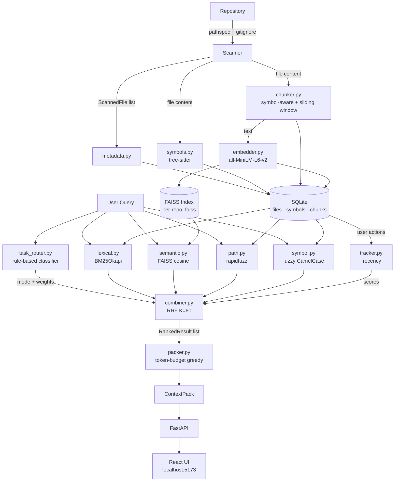

<div align="center">

# RepoMemory

**Local-first code retrieval engine for AI coding workflows**

[](https://www.python.org/)
[](https://fastapi.tiangolo.com)
[](https://react.dev)
[](https://vitest.dev)
[](https://opensource.org/licenses/MIT)

*Index a codebase with one command. Search with natural language. Get token-budget-aware context packs - ready to paste into any LLM.*

</div>

---

## Table of Contents

1. [What is RepoMemory?](#what-is-repomemory)
2. [Features](#features)
3. [Architecture](#architecture)
4. [Prerequisites](#prerequisites)
5. [Installation](#installation)
6. [Quick Start](#quick-start)
7. [Running the Servers](#running-the-servers)
8. [Testing](#testing)
9. [API Reference](#api-reference)
10. [Task Modes](#task-modes)
11. [Configuration](#configuration)
12. [Project Structure](#project-structure)
13. [Tech Stack](#tech-stack)
14. [How It Works - Deep Dive](#how-it-works--deep-dive)
15. [Benchmark Suite](#benchmark-suite)
16. [Contributing](#contributing)

---

## What is RepoMemory?

When you ask an LLM to fix a bug or trace a feature, it needs the *right* source files. Pasting the entire codebase wastes the context window. Guessing which files to include misses critical pieces.

RepoMemory solves this with a **hybrid retrieval pipeline**:

```
"Where is token rotation handled?"
        ↓
  Task Classification → bug_fix mode
        ↓
  BM25 Lexical + FAISS Semantic + Fuzzy Path/Symbol (parallel)
        ↓
  Reciprocal Rank Fusion  →  Top 20 ranked files
        ↓
  Token-budget packer (8 000 tokens default)
        ↓
  Context Pack: 3 files, 512 tokens, ready to use
```

Everything runs **locally** - no API keys, no cloud calls, no data leaves your machine.

---

## Features

| Feature | Details |
|---------|---------|
| **Hybrid search** | BM25 lexical + FAISS semantic + fuzzy path + symbol name - all fused with RRF |
| **Symbol-aware indexing** | tree-sitter extracts functions, classes, methods from Python / JS / TS |
| **4 Task Modes** | Bug Fix, Trace Flow, Test Lookup, Config Lookup  - auto-detected or manual |
| **Token budgets** | Greedy packer respects any token limit (default 8 000, configurable up to 100 000) |
| **Behavioral memory** | Tracks opened / accepted / thumbs-up actions; frecency score boosts future results |
| **Relevance explanations** | Every result comes with a human-readable reason: *"High lexical match for 'rotate_token'; semantically similar to query"* |
| **Export formats** | Copy context pack as Markdown (paste into LLM prompt) or JSON |
| **Incremental indexing** | SHA-256 hash per file; only changed files are re-embedded |
| **Benchmark suite** | Recall@k, MRR, NDCG, MAP - run against YAML query sets |
| **REST API + Swagger UI** | Full OpenAPI docs at `localhost:8000/docs` |
| **Web UI** | Dark-themed React frontend - search, explore, manage repos, view memory |

---

## Architecture



---

## Prerequisites

| Tool | Version | Install |
|------|---------|---------|
| Python | 3.11 or 3.12 | [python.org](https://www.python.org/downloads/) |
| pip | latest | bundled with Python |
| Node.js | 18+ | [nodejs.org](https://nodejs.org/) |
| npm | 9+ | bundled with Node.js |

> No Docker required for development. All data is stored locally in `~/.repomemory/`.

---

## Installation

```bash
# Clone
git clone https://github.com/aayushakumar/RepoMemory.git
cd RepoMemory

# Install both backend and frontend
make install
```

Or step by step:

```bash
# Backend
cd backend
pip install -e ".[dev]"

# Frontend
cd ../frontend
npm install
```

The first `make install` (or `pip install`) will download:
- `all-MiniLM-L6-v2` sentence-transformer (~80 MB) on first index
- tree-sitter grammars for Python / JavaScript / TypeScript

---

## Quick Start

**1. Start the API server**

```bash
make dev
# INFO: Uvicorn running on http://0.0.0.0:8000
```

**2. Start the frontend**

```bash
make dev-frontend
# VITE v8 ready → http://localhost:5173
```

**3. Index a repository**

Via the UI - go to **Repositories** → enter a path → click **Index Repository**.

Or via `curl`:

```bash
curl -s -X POST http://localhost:8000/api/repos \
  -H "Content-Type: application/json" \
  -d '{"path": "/path/to/your/repo"}' | python3 -m json.tool
```

Response:
```json
{
  "id": 1,
  "name": "your-repo",
  "path": "/path/to/your/repo",
  "status": "ready",
  "file_count": 147,
  "symbol_count": 892,
  "chunk_count": 1034
}
```

**4. Search**

```bash
curl -s -X POST http://localhost:8000/api/search \
  -H "Content-Type: application/json" \
  -d '{"repo_id": 1, "query": "Where is token rotation handled?", "token_budget": 8000}' \
  | python3 -m json.tool
```

---

## Running the Servers

| Command | Effect |
|---------|--------|
| `make dev` | FastAPI backend with hot-reload → `localhost:8000` |
| `make dev-frontend` | Vite dev server → `localhost:5173` |
| `make dev-all` | Both at once (background + foreground) |

The Vite dev server proxies all `/api/*` and `/health` requests to `localhost:8000`, so the frontend and backend work together without CORS issues during development.

**Swagger UI**: `http://localhost:8000/docs`  
**ReDoc**: `http://localhost:8000/redoc`

---

## Testing

### Backend tests (pytest)

```bash
# All tests
make test

# With verbose output
cd backend && python -m pytest tests/ -v

# Single test file
cd backend && python -m pytest tests/test_retrieval.py -v

# With coverage
cd backend && python -m pytest tests/ --cov=repomemory --cov-report=term-missing
```

**Backend test suite** - 28 tests across 5 files:

| File | Tests | What it covers |
|------|-------|---------------|
| `test_scanner.py` | 5 | File walking, gitignore rules, content hashing |
| `test_symbols.py` | 6 | tree-sitter extraction for Python / JS / TS |
| `test_retrieval.py` | 7 | Task router, end-to-end search, snippet loading |
| `test_packer.py` | 4 | Token budget enforcement, Markdown export |
| `test_metrics.py` | 6 | Recall@k, Precision@k, MRR, MAP, NDCG |

### Frontend tests (Vitest + Testing Library)

```bash
# Run once
make test-frontend
# or
cd frontend && npm test

# Watch mode (re-runs on file save)
cd frontend && npm run test:watch

# With browser-based UI
cd frontend && npm run test:ui

# Coverage report
cd frontend && npm run test:coverage
```

**Frontend test suite** - 41 tests across 5 files:

| File | Tests | What it covers |
|------|-------|---------------|
| `ResultCard.test.tsx` | 10 | Expand/collapse, score display, snippet rendering |
| `ContextPackView.test.tsx` | 8 | Token bar, file list, clipboard copy (Markdown / JSON) |
| `Sidebar.test.tsx` | 7 | Nav links, active state, brand name |
| `api.test.ts` | 7 | HTTP client - correct methods, URLs, request bodies, error handling |
| `markdownExport.test.ts` | 9 | Markdown export format - query, mode, tokens, code fences |

### Run all tests

```bash
make test-all
```

---

## API Reference

### Repositories

| Method | URL | Body | Description |
|--------|-----|------|-------------|
| `POST` | `/api/repos` | `{ "path": "/abs/path" }` | Index a new repository |
| `GET` | `/api/repos` | - | List all indexed repositories |
| `GET` | `/api/repos/{id}` | - | Get repository details & stats |
| `POST` | `/api/repos/{id}/reindex` | - | Force full re-index |
| `DELETE` | `/api/repos/{id}` | - | Remove from index (DB + FAISS) |

### Search

| Method | URL | Body | Description |
|--------|-----|------|-------------|
| `POST` | `/api/search` | `SearchRequest` | Search + build context pack |
| `GET` | `/api/search/modes` | - | List task modes with keywords |

**SearchRequest schema:**
```json
{
  "repo_id": 1,
  "query": "Where is token rotation handled?",
  "mode": null,
  "top_k": 20,
  "token_budget": 8000
}
```
`mode` accepts `null` (auto-detect), `"bug_fix"`, `"trace_flow"`, `"test_lookup"`, `"config_lookup"`, `"general"`.

**SearchResponse schema:**
```json
{
  "context_pack": {
    "query": "...",
    "mode": "bug_fix",
    "files": [{ "path": "auth/token_handler.py", "relevance_score": 0.92, "reason": "...", "snippets": [...] }],
    "total_tokens": 512,
    "budget": 8000,
    "budget_used_pct": 6.4
  },
  "ranked_results": [
    {
      "file_id": 1,
      "file_path": "auth/token_handler.py",
      "combined_score": 0.87,
      "component_scores": { "lexical": 0.8, "semantic": 0.6, "path_match": 0.2, "symbol_match": 0.9, "memory_frecency": 0.1, "git_recency": 0.0 },
      "explanation": "High lexical match; contains rotate_token()",
      "snippets": [...]
    }
  ],
  "classified_mode": "bug_fix",
  "query_id": 42,
  "latency_ms": 84.3
}
```

### Memory

| Method | URL | Body | Description |
|--------|-----|------|-------------|
| `POST` | `/api/actions` | `ActionRequest` | Record feedback (thumbs up, selected, etc.) |
| `GET` | `/api/memory/{repo_id}/stats` | - | Memory stats for a repo |
| `DELETE` | `/api/memory/{repo_id}` | - | Clear all memory for a repo |

**ActionRequest schema:**
```json
{
  "query_id": 42,
  "target_type": "file",
  "target_id": 1,
  "action": "thumbs_up"
}
```
Valid `action` values: `opened`, `selected`, `accepted`, `dismissed`, `thumbs_up`, `thumbs_down`.

### Evaluation

| Method | URL | Body | Description |
|--------|-----|------|-------------|
| `POST` | `/api/eval/run` | `{ "repo_id": 1, "query_set": "sample_repo" }` | Run benchmark suite |
| `GET` | `/api/eval/query-sets` | - | List available query sets |

### Health

```
GET /health  →  { "status": "ok", "version": "0.1.0" }
```

---

## Task Modes

RepoMemory automatically classifies each query into one of five modes. Modes change the scoring weights to surface the most relevant results.

| Mode | Trigger Keywords | Scoring Bias |
|------|----------------|--------------|
| **Bug Fix** 🐛 | `bug`, `fix`, `error`, `exception`, `crash`, `fail`, `broken`, `traceback`, `TypeError`, `ValueError`, `undefined`, `null` | Boosts lexical (exact error terms), includes test files |
| **Trace Flow** 🔗 | `trace`, `flow`, `route`, `endpoint`, `handler`, `pipeline`, `how does...work`, `from...to`, `call chain` | Boosts symbol matching, promotes call-chain ordering |
| **Test Lookup** 🧪 | `test`, `spec`, `coverage`, `assert`, `mock`, `fixture`, `unit test`, `integration test`, `e2e` | Boosts path matching to `tests/` and `spec/` directories |
| **Config Lookup** ⚙️ | `config`, `setting`, `env`, `environment`, `flag`, `parameter`, `yaml`, `toml`, `ini`, `.env`, `variable` | Filters to config-like files, boosts path matching |
| **General** 🔍 | *(fallback)* | Balanced weights across all signals |

You can force a mode in the UI (mode chips on the search bar) or via the `mode` field in the API.

---

## Configuration

Settings are managed by `pydantic-settings`. Set via **environment variables** with the `REPOMEMORY_` prefix:

```bash
# Example: use a higher-quality embedding model
export REPOMEMORY_EMBEDDING_MODEL=all-mpnet-base-v2

# Example: store data in a custom path
export REPOMEMORY_DATA_DIR=/data/repomemory

# Example: allow very large files
export REPOMEMORY_MAX_FILE_SIZE_KB=2000
```

| Variable | Default | Description |
|----------|---------|-------------|
| `REPOMEMORY_DATA_DIR` | `~/.repomemory` | Root directory for all data |
| `REPOMEMORY_EMBEDDING_MODEL` | `all-MiniLM-L6-v2` | sentence-transformers model name |
| `REPOMEMORY_EMBEDDING_DIM` | `384` | Embedding vector dimension (must match model) |
| `REPOMEMORY_EMBEDDING_BATCH_SIZE` | `64` | Batch size for embedding generation |
| `REPOMEMORY_MAX_FILE_SIZE_KB` | `500` | Files larger than this are skipped |
| `REPOMEMORY_TOKEN_BUDGET` | `8000` | Default context pack token budget |
| `REPOMEMORY_SLIDING_WINDOW_LINES` | `200` | Lines per chunk when no symbols found |
| `REPOMEMORY_CORS_ORIGINS` | `["http://localhost:5173", ...]` | Allowed CORS origins |

**Supported file extensions** (indexed by default):
`.py` `.js` `.ts` `.tsx` `.jsx` `.json` `.yaml` `.yml` `.toml` `.ini` `.cfg` `.conf` `.md` `.rst` `.txt` `.html` `.css` `.scss` `.sh` `.sql` `.env` `Dockerfile` `Makefile`

---

## Project Structure

```
RepoMemory/
├── Makefile                         # All dev commands
├── PRD.md                           # Product Requirements Document
├── README.md
│
├── backend/
│   ├── pyproject.toml               # Python project metadata + deps
│   ├── src/
│   │   └── repomemory/
│   │       ├── config.py            # pydantic-settings Settings class
│   │       ├── models/
│   │       │   ├── tables.py        # SQLAlchemy ORM (6 tables)
│   │       │   ├── db.py            # Engine, session factory, init_db()
│   │       │   └── schemas.py       # Pydantic request/response models
│   │       ├── indexer/
│   │       │   ├── scanner.py       # scan_repository() - pathspec + gitignore
│   │       │   ├── metadata.py      # extract_and_store_metadata()
│   │       │   ├── symbols.py       # tree-sitter → Python / JS / TS symbols
│   │       │   ├── chunker.py       # symbol-aware + sliding-window chunking
│   │       │   ├── embedder.py      # sentence-transformers + FAISS per-repo index
│   │       │   └── orchestrator.py  # index_repository() - full pipeline
│   │       ├── retrieval/
│   │       │   ├── lexical.py       # BM25Okapi over chunk content
│   │       │   ├── semantic.py      # FAISS cosine similarity
│   │       │   ├── path.py          # rapidfuzz fuzzy path matching
│   │       │   ├── symbol.py        # fuzzy symbol name search
│   │       │   ├── combiner.py      # RRF score fusion + RankedResult assembly
│   │       │   ├── task_router.py   # rule-based query → mode classifier
│   │       │   └── orchestrator.py  # retrieve() - parallel retrieval entry point
│   │       ├── context/
│   │       │   ├── packer.py        # build_context_pack() - greedy token budget
│   │       │   └── explainer.py     # template-based relevance explanations
│   │       ├── memory/
│   │       │   └── tracker.py       # record_action(), get_memory_scores() frecency
│   │       ├── evaluation/
│   │       │   ├── metrics.py       # recall_at_k, mrr, ndcg_at_k, average_precision
│   │       │   └── benchmark.py     # run_benchmark(), format_benchmark_table()
│   │       └── api/
│   │           ├── app.py           # create_app() factory + lifespan + CORS
│   │           ├── routes_index.py  # /api/repos CRUD + indexing
│   │           ├── routes_search.py # /api/search + /api/search/modes
│   │           ├── routes_memory.py # /api/actions + /api/memory/{id}
│   │           └── routes_eval.py   # /api/eval/run + /api/eval/query-sets
│   ├── tests/
│   │   ├── conftest.py              # temp SQLite DB fixture
│   │   ├── test_scanner.py
│   │   ├── test_symbols.py
│   │   ├── test_retrieval.py
│   │   ├── test_packer.py
│   │   ├── test_metrics.py
│   │   └── fixtures/
│   │       └── sample_repo/         # ~10 Python/JS/TS files for tests
│   └── benchmarks/
│       ├── queries/
│       │   └── sample_repo.yaml     # 20 benchmark queries across all modes
│       └── results/                 # JSON results written here after bench runs
│
└── frontend/
    ├── vite.config.ts               # Vite + Tailwind + Vitest config
    ├── package.json
    ├── src/
    │   ├── main.tsx                 # React entry point
    │   ├── App.tsx                  # Router + QueryClientProvider
    │   ├── index.css                # Tailwind v4 @theme dark palette
    │   ├── api/
    │   │   ├── types.ts             # TypeScript interfaces for all API shapes
    │   │   ├── client.ts            # fetch-based API client
    │   │   └── hooks.ts             # React Query hooks (useSearch, useRepos, …)
    │   ├── components/
    │   │   ├── Layout.tsx           # Sidebar + <Outlet /> wrapper
    │   │   ├── Sidebar.tsx          # Navigation (Search / Repos / Memory)
    │   │   ├── ResultCard.tsx       # Collapsible ranked result with score bars
    │   │   ├── ContextPackView.tsx  # Token budget bar + copy buttons
    │   │   └── CodeBlock.tsx        # Prism syntax-highlighted code snippet
    │   ├── pages/
    │   │   ├── SearchPage.tsx       # Main search UI
    │   │   ├── ReposPage.tsx        # Repo management
    │   │   └── MemoryPage.tsx       # Action history + frecency stats
    │   └── test/
    │       ├── setup.ts             # @testing-library/jest-dom import
    │       ├── ResultCard.test.tsx
    │       ├── ContextPackView.test.tsx
    │       ├── Sidebar.test.tsx
    │       ├── api.test.ts
    │       └── markdownExport.test.ts
    └── dist/                        # Production build output (npm run build)
```

---

## Tech Stack

### Backend

| Library | Version | Role |
|---------|---------|------|
| **FastAPI** | 0.115+ | REST API framework, async, OpenAPI docs |
| **SQLAlchemy** | 2.0 | ORM with `mapped_column` style; SQLite with WAL |
| **sentence-transformers** | 3.0+ | Local embedding - `all-MiniLM-L6-v2` (384-dim) |
| **FAISS** | 1.8+ | Vector similarity search (`IndexFlatIP` after L2 norm) |
| **tree-sitter** | 0.23+ | Incremental AST parsing for function/class extraction |
| **rank-bm25** | 0.2+ | Okapi BM25 lexical search over tokenized chunks |
| **rapidfuzz** | 3.9+ | Fuzzy string matching for path and symbol search |
| **tiktoken** | 0.7+ | Token counting (cl100k_base - accurate for GPT models) |
| **pydantic-settings** | 2.0+ | Config from env vars with `REPOMEMORY_` prefix |
| **pathspec** | 0.12+ | gitignore-compatible file ignore rules |
| **PyYAML** | 6.0+ | Benchmark query set loading |
| **pytest** | 9.0+ | Test runner |

### Frontend

| Library | Version | Role |
|---------|---------|------|
| **React** | 19 | UI framework |
| **TypeScript** | 5.8+ | Static typing |
| **Vite** | 8.0 | Dev server (HMR) + production bundler |
| **TailwindCSS** | 4.0 | Utility CSS with custom dark `@theme` |
| **@tanstack/react-query** | 5.0+ | Server state, automatic refetch, cache |
| **react-router-dom** | 7.0+ | Client-side routing |
| **react-syntax-highlighter** | 16.0+ | Prism syntax highlighting in code blocks |
| **lucide-react** | 1.7+ | Icon library |
| **Vitest** | 4.0+ | Unit test runner (Vite-native) |
| **@testing-library/react** | 16.0+ | DOM testing utilities |
| **jsdom** | 26.0+ | Browser environment for tests |

---

## How It Works - Deep Dive

### 1. Indexing pipeline

`index_repository(repo_id, repo_path)` in `indexer/orchestrator.py` runs 5 stages:

1. **Scan** - `scanner.py` walks the directory tree with `pathlib`, respects `.gitignore` via `pathspec("gitignore")`, filters by extension and file size. Returns a list of `ScannedFile` dataclasses with path, extension, size, and SHA-256 hash of the first 8 KB.

2. **Metadata** - `metadata.py` upserts rows into `files` table. Incremental: compares content hashes, skips unchanged files, removes deleted files.

3. **Symbol extraction** - `symbols.py` initialises tree-sitter parsers (one per language) and walks the AST to extract:
   - Python: `function_definition`, `class_definition`, `decorated_definition`
   - JavaScript / TypeScript: `function_declaration`, `class_declaration`, `method_definition`, `arrow_function`, `import_statement`, `export_statement`
   - Classes include their methods as children (`parent_symbol_id` FK).

4. **Chunking** - `chunker.py` produces `Chunk` records:
   - If a file has symbols, each function or class body becomes one chunk.
   - Uncovered regions (between symbols) are chunked if > 10 tokens.
   - Files without symbols fall back to a sliding window (200 lines, 50-line overlap).
   - Each chunk's token count is measured with `tiktoken` `cl100k_base`. Chunks > 512 tokens are split further.

5. **Embedding** - `embedder.py` encodes all chunks in batches of 64 with `sentence-transformers`. Vectors are L2-normalised then stored in a per-repo `faiss.IndexFlatIP`. A JSON sidecar maps `faiss_position → chunk_id`.

### 2. Retrieval pipeline

`retrieve(query, repo_id, mode)` in `retrieval/orchestrator.py`:

1. **Task classification** - `task_router.py` matches the query against keyword patterns (regex, multi-word phrases, word-boundary single words) and returns a mode name + `WeightProfile`.

2. **Parallel retrieval** - Four retrievers run concurrently in a `ThreadPoolExecutor(max_workers=4)`:
   - `lexical_search` - tokenises the query, scores chunks with BM25, normalises to [0,1].
   - `semantic_search` - encodes query, searches FAISS, clamps similarities to [0,1].
   - `path_search` - splits query into tokens, scores each file's path with `rapidfuzz.partial_ratio + ratio`, threshold 0.3.
   - `symbol_search` - extracts CamelCase / snake_case tokens from query, fuzzy-matches against all symbol names, threshold 0.4.

3. **Score fusion** - `combiner.py` uses **Reciprocal Rank Fusion** (RRF, K=60):
   ```
   rrf_score(d) = Σ  1 / (K + rank_in_list_i)
   ```
   Scores are aggregated per `file_id`. Memory frecency scores (from `tracker.py`) are added to the RRF total. Results are sorted descending.

4. **Context packing** - `packer.py` greedily adds the highest-scoring file's top snippets until the token budget is filled, then calls `explainer.py` to attach human-readable reason strings.

### 3. Memory / Frecency

Every search records a row in `queries`. When the user interacts with a result (via `POST /api/actions`), a row is inserted into `user_actions`.

`get_memory_scores(repo_id, file_ids)` computes:
```
score(file) = Σ  action_weight × 1 / (1 + days_since × 0.1)
```
Action weights: `thumbs_up=4`, `accepted=3`, `selected=2`, `opened=1`, `thumbs_down=-3`, `dismissed=-1`. Scores are normalised to [0,1] across the result set and fed into the combiner.

### 4. Score Fusion Detail (RRF)

RRF is used instead of a weighted sum because different retrievers produce scores on incompatible scales - cosine similarities cluster near 0.6–0.9 while BM25 scores span 0–40. RRF converts each list to *rank positions* first, making fusion stable regardless of absolute score distributions.

---

## Benchmark Suite

Benchmarks are stored as YAML query sets in `backend/benchmarks/queries/`.

### Format

```yaml
queries:
  - query: "Where is token rotation handled?"
    mode: bug_fix
    expected_files:
      - "auth/token_handler.py"
      - "tests/test_auth.py"
    expected_symbols:
      - "rotate_token"
    description: "Should find token handling and related tests"
```

### Running

```bash
# Via Makefile
make bench

# Via API
curl -X POST http://localhost:8000/api/eval/run \
  -H "Content-Type: application/json" \
  -d '{"repo_id": 1, "query_set": "sample_repo"}'
```

### Metrics

| Metric | Description |
|--------|-------------|
| **Recall@1** | Is the first result an expected file? |
| **Recall@5** | Are any expected files in the top 5? |
| **Recall@10** | Are any expected files in the top 10? |
| **Precision@5** | What fraction of the top 5 are expected files? |
| **MRR** | Mean Reciprocal Rank - `1 / (rank of first expected file)` |
| **MAP** | Mean Average Precision |
| **NDCG@5** | Normalized Discounted Cumulative Gain at 5 |
| **Avg Latency** | Mean query time in milliseconds |

Results are saved as timestamped JSON in `backend/benchmarks/results/`.

---

## Contributing

1. Fork + clone
2. `make install`
3. Create a feature branch
4. Write tests for your change (`make test-all`)
5. Open a PR

---

## License

MIT © Aayush Kumar
